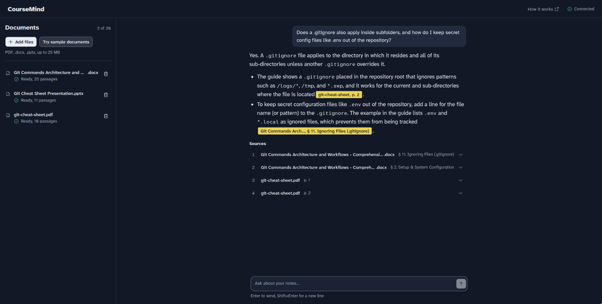
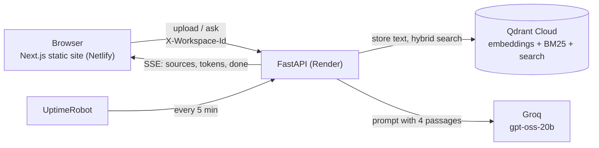

# CourseMind

Ask questions across your PDF, Word and PowerPoint course notes and get answers cited to the exact page, slide or section.

**Live demo:** https://coursemind-app.netlify.app (no sign-up; click "Try sample documents" to start)



> **Don't upload private documents.** There are no accounts. Your library is tied to a random id stored in your browser, and the demo runs on shared free-tier services.

## What it does

- **Upload** PDF, .docx and .pptx files (up to 25 MB each, 10 at a time, 30 per library).
- **Ask** in plain language. The answer streams in, and every claim carries a citation such as `lecture3.pdf, p. 12`, `slides.pptx, slide 8` or `notes.docx, § Deadlocks`.
- **Check the source.** Clicking a citation opens the exact passage the answer came from.
- **Across documents.** One question can pull from several files, and the answer cites each of them.
- **Refuses instead of guessing.** If your notes don't cover the question, the answer is "I couldn't find that in your notes."

## How it works



**Upload.** The API checks the file (size, extension, content signature, zip-bomb guard), extracts text per page, slide or Word section, and splits it into 700-character chunks with 100 characters of overlap. Each chunk keeps its location. Qdrant Cloud Inference computes the embeddings (`all-MiniLM-L6-v2` dense and BM25 sparse), so the small Render instance runs no ML model. The browser polls until the document shows "Ready".

**Ask.** One Qdrant query combines dense and BM25 search with reciprocal rank fusion, filtered to the ready documents in your library. The top 4 passages go into a prompt that tells the model to answer only from them and to cite them as `[n]`. Groq streams the answer back as server-sent events; if the main model is rate-limited, a larger fallback model takes over.

**Design choices worth knowing**
- Hybrid search was chosen by measurement, not assumed (see the evaluation below). BM25 adds exact-term matching (commands like `--hard`, file names like `.gitignore`) on top of meaning-based dense search.
- Documents live in Qdrant, not on the server, because Render's free disk is wiped on every restart.
- Rate limits (5 questions per minute, 30 uploads per hour, per IP) protect the free Groq quota. They key on Cloudflare's `CF-Connecting-IP`, which clients can't forge.

## Results

All numbers below come from real runs.

### Retrieval quality

15 questions over the 3 sample files (a 2-page PDF, an 11-slide deck and a 22-section Word guide); 3 of them need two documents to answer. A hit means a passage from the expected location that contains the expected evidence. Full grid: [`backend/eval/results.md`](backend/eval/results.md).

| Mode (700-character chunks) | hit@2 | hit@4 | MRR@6 | Both documents in top 4 (3 two-document questions) |
|---|---|---|---|---|
| Dense only | 13/15 | 15/15 | 0.911 | 2/3 |
| **Hybrid: dense + BM25 (chosen)** | **14/15** | **15/15** | **0.889** | **3/3** |
| Hybrid + ColBERT re-rank | 13/15 | 14/15 | 0.911 | 3/3 |

- **Hybrid over dense:** one more hit at k=2, and both documents found for all 3 two-document questions instead of 2.
- **ColBERT re-ranking** gave no gain on this data (one question worse), so it is off by default. It is still available with `RETRIEVAL_MODE=hybrid_rerank`.
- **Grounding:** 3/3 out-of-scope questions (for example "What is the difference between TCP and UDP?") got the refusal sentence.
- **Caveat:** 15 questions is a small set; a difference of one question is within run-to-run noise.

### Latency

Measured on the live deployment from a laptop in India to the backend in Oregon, so every number includes the network round trip (about 0.25–0.3 s per request). Run on 2026-09-30 against a library of the 3 samples plus the 50-page PDF; all 10 questions were answered by `gpt-oss-20b`.

| | Result |
|---|---|
| First token (median of 10 questions) | 0.71 s (range 0.59–1.16 s) |
| Full answer (median of 10 questions) | 1.14 s (range 0.80–1.61 s) |
| 50-page PDF, upload to "Ready" | 4.9 s |

The 50-page PDF was generated text (about 2,500 characters per page, 233 chunks), so it measures the pipeline, not a particular course file.

## Tech stack

| Part | Choice |
|---|---|
| Frontend | Next.js 16 (static export), React 19, TypeScript, Tailwind CSS 4, shadcn/ui; hosted on Netlify |
| Backend | Python 3.12, FastAPI, Pydantic; hosted on Render (free) |
| Parsing | pypdfium2 (PDF), python-docx, python-pptx; LangChain text splitter |
| Search | Qdrant Cloud with Cloud Inference: `all-MiniLM-L6-v2` dense, BM25 sparse, optional `answerai-colbert-small-v1` re-rank |
| Answers | Groq `openai/gpt-oss-20b`, falling back to `openai/gpt-oss-120b`, streamed with LangChain |
| Uptime | UptimeRobot pings the API every 5 minutes so the free instance never sleeps |

## Run it locally

You need Python 3.12, Node.js 20.9 or later, a free [Qdrant Cloud](https://cloud.qdrant.io) cluster (Cloud Inference is included) and a free [Groq](https://console.groq.com) API key.

**Backend** (http://localhost:8000):

```bash
cd backend
python3.12 -m venv .venv
.venv/bin/pip install -r requirements.txt
cp .env.example .env
```

Fill in `GROQ_API_KEY`, `QDRANT_URL` and `QDRANT_API_KEY` in `backend/.env`, then start the API. It creates its Qdrant collections on first start.

```bash
cd backend
.venv/bin/uvicorn app.main:app --reload
```

**Frontend** (http://localhost:3000; it calls `http://localhost:8000` unless `NEXT_PUBLIC_API_URL` is set):

```bash
cd frontend
npm install
npm run dev
```

**Tests and evaluation:**

```bash
cd backend
.venv/bin/pip install -r requirements-dev.txt
.venv/bin/pytest -q
```

Tests marked `live` call Qdrant and Groq and are skipped when their keys are missing. `.venv/bin/python -m eval.run_eval --refusal` rebuilds the evaluation above in temporary collections. Frontend unit tests: `cd frontend && npm test`.

## Limits

| Limit | Value |
|---|---|
| File types | PDF, .docx, .pptx with selectable text (no OCR: a scanned PDF is marked "No selectable text found") |
| File size | 25 MB each; 10 files per batch |
| Library | 30 documents |
| Question length | 3 to 500 characters |
| Rate limits (per IP) | 5 questions per minute, 30 uploads per hour |
| Whole demo | 30,000 stored chunks across all users |

**Citation precision.** PDFs cite pages and decks cite slides. Word files have no fixed pages, so they cite the nearest heading. Text inside images is not read, and slide text follows the order it was added in PowerPoint, which is not always the visual order.

**Free tiers.** If Groq's per-minute limit is hit, the answer says to try again in a minute; if both models run out of daily tokens, it says the demo has reached today's question limit.

## Project layout

```
backend/
  app/        FastAPI app: routes, validation, rate limits (main.py), parsing (parsing.py),
              Qdrant storage and search (store.py), prompt and Groq streaming (llm.py)
  eval/       15-question retrieval evaluation and its results
  samples/    the 3 sample documents
  tests/      offline tests, plus live tests against Qdrant and Groq
frontend/
  app/        Next.js pages and global styles
  components/ workspace, library, thread, answer and citation UI
  lib/        typed API client with the SSE reader, answer parser, limits
render.yaml   Render blueprint (backend)
netlify.toml  Netlify build (frontend)
```
